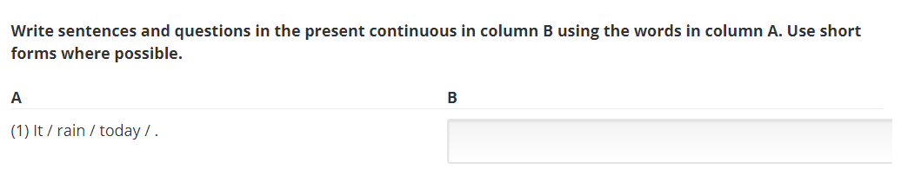
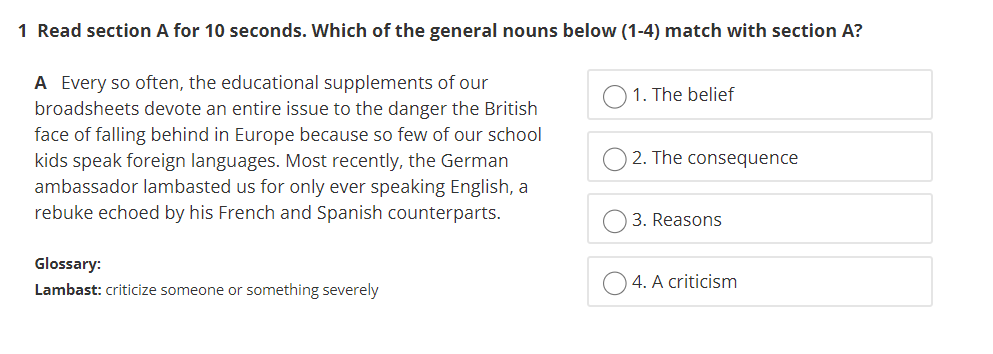

# HTML Code

## <a id="Content">**Content**</a>
| Sl.No|  Questions        |
|------|------------------ |
| 01.  |[Border ](#Border )|
| 02.  |[Div giống pre ](#Div-giống-pre)|
| 03.  |[Recording trong listening ](#Recording-trong-listening)|
| 04.  |[Định dạng số thứ tự đậm và có cách ](#Định-dạng-số-thứ-tự-đậm-và-có-cách)|
| 05.  |[Bullet ](#Bullet)|
| 06.  |[Dạng text input chia 2 bên ](#Dạng-text-input-chia-2-bên)|
| 07.  |[Audio 1 cục nhỏ k download ](#Audio-1-cục-nhỏ-k-download)|
| 08.  |[Audio thanh dài k download ](#Audio-thanh-dài-k-download)|
| 09.  |[Text 1 bên câu hỏi 1 bên ](#Text-1-bên-câu-hỏi-1-bên)|
| 10.  |[Inline dropdown ](#Inline-dropdown)|
| 11.  |[Multiple choice ](#Multiple-choice)|
| 12.  |[Bài reading text có scroll bar dọc ](#Bài-reading-text-có-scroll-bar-dọc)|

## <a id="Border"></a>***1. Border***
```
<div style="border: 2px solid rgb(121, 111, 111); padding: 10px">
```
<div align="right">
    <b><a href="#Content">↥ back to top</a></b>
</div>

## <a id="Div-giống-pre"></a>***2. Div giống pre***
```
<div style="padding: 6px 10px; border: 1px solid #ccc; border-radius: 3px; background-color: #f9f9f9; font-size: .9em; line-height: 1.4;">
```
<div align="right">
    <b><a href="#Content">↥ back to top</a></b>
</div>

## <a id="Recording-trong-listening"></a>***3. Recording trong listening***
**Vào HTML -> Raw HTML**
```
<button
    onclick='var x=document.getElementById("idUniquedBoxContent");"none"===x.style.display?x.style.display="block":x.style.display="none";'>Recording script
</button>
<div id="idUniquedBoxContent" style="display: none;">
    Recording script.
    Recording script.
</div>
```
<div align="right">
    <b><a href="#Content">↥ back to top</a></b>
</div>

## <a id="Định-dạng-số-thứ-tự-đậm-và-có-cách"></a>***4. Định dạng số thứ tự đậm và có cách***
```
<b>1</b> &#160;
```
<div align="right">
    <b><a href="#Content">↥ back to top</a></b>
</div>

## <a id="Bullet"></a>***5. Bullet***
```
<ul style="list-style-type:circle">
    <li>Coffee</li>
    <li>Tea</li>
    <li>Milk</li>
</ul>

<ul style="list-style-type:disc">
    <li>Coffee</li>
    <li>Tea</li>
    <li>Milk</li>
</ul>

<ul style="list-style-type:square">
    <li>Coffee</li>
    <li>Tea</li>
    <li>Milk</li>
</ul>
```
<div align="right">
    <b><a href="#Content">↥ back to top</a></b>
</div>

## <a id="Dạng-text-input-chia-2-bên"></a>***6. Dạng text input chia 2 bên***
<p align="center">
  
</p>

```
<div style="display: flex;width: 100%;border-bottom: 1px solid #eee;margin:10px 0px;">
    <div style="width: 50%;">(1) It / rain / today / .</div>
    <div style="width: 50%;">
        <stringresponse answer="It’s raining today." type="ci">
            <textline size="100%" />
        </stringresponse>
    </div>
</div>
```
<div align="right">
    <b><a href="#Content">↥ back to top</a></b>
</div>

## <a id="Audio-1-cục-nhỏ-k-download"></a>***7. Audio 1 cục nhỏ k download***

```
<audio id="ac2" src="LINK"></audio>
= 0) {if (!myAudio.started) {myAudio.play();playOrPause.src = iconPause;isPause = false;}}}if (isPause) {myAudio.pause();playOrPause.src = iconPlay;} myAudio.onended = function() {playOrPause.src = iconPlay;};"
    style="cursor: pointer;" src="https://iili.io/RshnRe.png" />
```
<div align="right">
    <b><a href="#Content">↥ back to top</a></b>
</div>

## <a id="Audio-thanh-dài-k-download"></a>***8. Audio thanh dài k download***

```
<audio controls="" controlsList="nodownload" src="LINK"></audio>
```
<div align="right">
    <b><a href="#Content">↥ back to top</a></b>
</div>

## <a id="Text-1-bên-câu-hỏi-1-bên"></a>***9. Text 1 bên câu hỏi 1 bên***
<p align="center">
  
</p>

```
<problem>
    <p><b><b>1</b> &#160;Read section A for 10 seconds. Which of the general nouns below
            (1-4) match with section A?</b></p>
    <div style="width: 93%; overflow-x: visible; height: 400px; display:flex;">
        <div style="height: 100%;width: 60%;padding: 0px 15px;">
            <p><b>A</b> &#160; Every so often, the educational supplements of our broadsheets devote an entire
                issue to the
                danger the British face of falling behind in Europe because so few of our school kids speak
                foreign
                languages. Most recently, the German ambassador lambasted us for only ever speaking English, a
                rebuke echoed
                by his French and Spanish counterparts.
            </p>
            <p style="font-size: small"><b>Glossary:</b><br />
                <b>Lambast:</b> criticize someone or something severely
            </p>
        </div>
        <div style="height: 100%;width: 40%; padding: 0px 15px;">
            <multiplechoiceresponse>
                <choicegroup type="MultipleChoice">
                    <choice correct="false">1. The belief</choice>
                    <choice correct="false">2. The consequence</choice>
                    <choice correct="false">3. Reasons</choice>
                    <choice correct="true">4. A criticism</choice>
                </choicegroup>
            </multiplechoiceresponse>
        </div>
    </div>
</problem>
```
<div align="right">
    <b><a href="#Content">↥ back to top</a></b>
</div>

## <a id="Inline-dropdown"></a>***10. Inline dropdown***

```
<inline_dropdown schema_version='1'>
    <body>
        <p>A fruit is the fertilized ovary of a tree or plant and contains seeds. Given this, a
            <input_ref input="i1" /> is consider a fruit, while a
            <input_ref input="i2" /> is considered a vegetable.
        </p>
    </body>

    <optionresponse>
        <optioninput id="i1">
            <option correct="True">tomato</option>
            <option correct="False">potato</option>
        </optioninput>
    </optionresponse>

    <optionresponse>
        <optioninput id="i2">
            <option correct="False">cucumber </option>
            <option correct="True">onion</option>
        </optioninput>
    </optionresponse>
</inline_dropdown>
```
<div align="right">
    <b><a href="#Content">↥ back to top</a></b>
</div>

## <a id="Multiple-choice"></a>***11. Multiple choice***
**Nằm trong thẻ problem**

```
<multiplechoiceresponse>
    <choicegroup type="MultipleChoice"> 
        <choice correct="true"><b>a.</b> Beaumaris: a castle of contrasts </choice>
        <choice correct="false"><b>b.</b> Beaumaris: a typical medieval castle </choice>
        <choice correct="false"><b>c.</b> Beaumaris: the oldest Welsh castle</choice>
    </choicegroup>
</multiplechoiceresponse>
```
<div align="right">
    <b><a href="#Content">↥ back to top</a></b>
</div>

## <a id="Bài-reading-text-có-scroll-bar-dọc"></a>***12. Bài reading text có scroll bar dọc***
**Nằm trong thẻ problem**

```
<hr/>
<div style="width: 97%; overflow-x: visible;">
    <div style="height: 400px; display:flex;">
        <div style="height: 100%; overflow-y: scroll; flex: 0 0 100%; padding-right: 15px; padding-left: 15px; ">
            <center style="border:none;padding:0px;margin:0;font-size: 30px;">
                <b>Freya Stark, explorer and writer</b>
            </center>
            <br />
            <p>Freya Stark travelled to many areas of the Middle East, often alone. </p>
            <p>
                Freya Stark was an explorer who lived during a time when explorers were regarded as heroes. She travelled
                to distant areas of the Middle East, where few Europeans – especially women-had travelled before. She
                also travelled extensively in Turkey, Greece, Italy, Nepal and Afghanistan.
            </p>
            <p>
                Stark was born in Paris in 1893. Although she had no formal education as a child, she moved about with
                her artist parents and learned French, German and Italian. She entered London University in 1912, but at
                the start of World War I, she joined the nurse corps and was sent to Italy. After the war, she returned
                to London and attended the School of Oriental Studies. Her studies there led to extensive travel in the
                Middle East, enabling her to eventually become fluent in Persian, Russian and Turkish. Stark became well
                known as a traveller and explorer in the Middle East. She travelled to the Lebanon in 1927 at the age of
                33 when she had saved enough money, and while there, she studied Arabic. In 1928, she travelled by
                donkey to the Jebel Druze, a mountainous area in Syria.
            </p>
        </div>

    </div>
</div>
<p/>
<hr/>
```
<div align="right">
    <b><a href="#Content">↥ back to top</a></b>
</div>